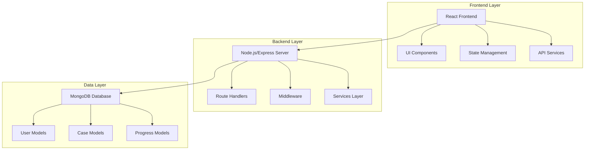

# System Architecture Overview

**Effective Date**: 2025-10-17  
**Author**: Kilo Code System  
**Review Cycle**: Quarterly

## High-Level Architecture

## Core Components

### Frontend Architecture
- **Framework**: React with TypeScript
- **State Management**: Local component state + API integration
- **UI Library**: Tailwind CSS with custom components
- **Key Directories**:
  - `simulatorfrontend/src/components/`
  - `simulatorfrontend/src/pages/`
  - `simulatorfrontend/src/services/`

### Backend Architecture
- **Framework**: Node.js with Express.js
- **Database**: MongoDB with Mongoose ODM
- **Authentication**: JWT-based auth system
- **Key Directories**:
  - `SimulatorBackend/src/routes/`
  - `SimulatorBackend/src/services/`
  - `SimulatorBackend/src/models/`

### Data Models
- **User Management**: [`UserModel.js`](../../../SimulatorBackend/src/models/UserModel.js)
- **Case Management**: Case templates and simulations
- **Progress Tracking**: User progress and performance metrics
- **Authentication**: Role-based access control (RBAC)

## Key Services

### Authentication System
- JWT token-based authentication
- Role-based access control (RBAC)
- User registration and login workflows
- **Documentation**: [`Authentication_System.md`](../../../SimulatorBackend/docs/Authentication_System.md)

### Case Management System
- Case creation and publishing workflows
- Template-based case generation
- Multi-specialty support (Internal Medicine, Radiology, Laboratory, etc.)
- **Documentation**: [`CASE_CREATION_WORKFLOW.md`](../../../SimulatorBackend/docs/CASE_CREATION_WORKFLOW.md)

### Progress Tracking System
- User progress monitoring
- Performance analytics
- Learning path recommendations
- **Documentation**: [`Student_Interface.md`](../../../SimulatorBackend/docs/STUDENT_INTERFACE.md)

## Integration Points

### API Endpoints
- RESTful API design
- Swagger documentation integration
- CORS configuration for frontend-backend communication

### Database Schema
- MongoDB collections with relationships
- Mongoose schemas for data validation
- Indexing strategies for performance

## Security Considerations
- Input validation and sanitization
- SQL injection prevention
- XSS protection
- CORS configuration
- Rate limiting

## Performance Optimizations
- Database indexing
- Caching strategies
- Lazy loading for frontend components
- API response optimization