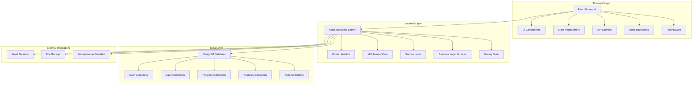

# System Architecture Overview

**Effective Date**: 2025-10-20
**Author**: Kilo Code System
**Review Cycle**: Quarterly

## High-Level Architecture

## Core Components

### Frontend Architecture
- **Framework**: React 18+ with TypeScript
- **State Management**: React hooks + Context API
- **UI Library**: Tailwind CSS with custom design system
- **Testing**: Jest + React Testing Library + Cypress (E2E)
- **Key Directories**:
  - `simulatorfrontend/src/components/` - 25+ reusable components
  - `simulatorfrontend/src/pages/` - Route-based page components
  - `simulatorfrontend/src/services/` - API integration layer
  - `simulatorfrontend/src/hooks/` - Custom React hooks
  - `simulatorfrontend/src/utils/` - Utility functions and helpers

### Backend Architecture
- **Framework**: Node.js with Express.js
- **Database**: MongoDB with Mongoose ODM
- **Authentication**: JWT-based with RBAC
- **Testing**: Jest + Supertest for API testing
- **Key Directories**:
  - `SimulatorBackend/src/routes/` - API route definitions
  - `SimulatorBackend/src/services/` - 40+ business logic services
  - `SimulatorBackend/src/models/` - Database schemas
  - `SimulatorBackend/src/middleware/` - Request processing middleware
  - `SimulatorBackend/src/utils/` - Helper functions

### Data Models
- **User Management**: Authentication, profiles, preferences
- **Case Management**: Templates, simulations, assessments
- **Progress Tracking**: Performance metrics, learning analytics
- **Content Management**: Educational materials, feedback systems
- **Audit Logging**: System events, user actions, security events

## Service Architecture

### Core Service Categories

#### Authentication & Authorization Services
- **authService**: JWT token management, password handling
- **RBACService**: Role-based access control implementation
- **UserRegistrationService**: User onboarding workflows
- **privacyService**: Data privacy and GDPR compliance

#### Case Management Services
- **CaseService**: Core case operations (CRUD)
- **CaseTemplateService**: Template management and validation
- **CasePublishingService**: Publication workflows and approvals
- **CaseReviewService**: Quality assurance and peer review
- **CaseSearchService**: Advanced search and filtering
- **CaseOrganizationService**: Categorization and taxonomy

#### Educational Services
- **simulationService**: Interactive simulation management
- **AssessmentAnalyticsService**: Performance evaluation
- **LearningPathService**: Personalized learning recommendations
- **IntelligentTutoringService**: AI-powered guidance
- **FeedbackService**: Student feedback collection and analysis
- **CompetencyAssessmentService**: Skills evaluation

#### Analytics & Reporting Services
- **AnalyticsService**: System-wide analytics
- **ProgressAnalyticsService**: Learning progress tracking
- **CaseContentAnalyticsService**: Content effectiveness metrics
- **StudentProgressService**: Individual student analytics
- **EducatorDashboardService**: Instructor analytics
- **ProgressPDFService**: Report generation

#### Medical Specialty Services
- **RadiologySimulationService**: Radiology-specific simulations
- **LaboratorySimulationService**: Lab test simulations
- **PharmacySimulationService**: Pharmacy scenarios
- **nursingEvaluationService**: Nursing assessment tools
- **InternalMedicineService**: Medical case simulations

#### Administrative Services
- **AdminUserManagementService**: User administration
- **AdminStatsService**: Administrative reporting
- **QualityCheckService**: Content quality validation
- **AuditLoggerService**: System audit trails
- **SupportService**: Help desk and user support

#### Infrastructure Services
- **emailService**: Email notifications and communications
- **queueService**: Background job processing
- **MultimediaUploadService**: File upload handling
- **ResourceIntegrationService**: External resource management

## Integration Points

### API Architecture
- **RESTful Design**: Resource-based endpoints
- **Versioning**: API versioning strategy
- **Rate Limiting**: Request throttling for performance
- **CORS Configuration**: Cross-origin resource sharing
- **Authentication**: JWT token validation middleware

### Database Integration
- **Connection Pooling**: Efficient database connections
- **Indexing Strategy**: Performance optimization
- **Schema Validation**: Data integrity constraints
- **Migration System**: Database schema evolution
- **Backup Strategy**: Data protection and recovery

### External Integrations
- **Email Services**: SMTP and email template management
- **File Storage**: Multimedia content storage
- **Authentication**: OAuth and social login providers
- **Analytics**: Usage tracking and reporting

## Security Architecture

### Authentication & Authorization
- **JWT Implementation**: Stateless token-based auth
- **Password Security**: Bcrypt hashing with salt
- **Session Management**: Secure session handling
- **Role-Based Access**: Granular permission system

### Data Protection
- **Input Validation**: Comprehensive sanitization
- **SQL Injection Prevention**: Parameterized queries
- **XSS Protection**: Content security policies
- **CSRF Protection**: Cross-site request forgery prevention
- **Data Encryption**: Sensitive data protection

### Infrastructure Security
- **HTTPS Enforcement**: Secure communication
- **Helmet Integration**: Security headers
- **Rate Limiting**: DDoS protection
- **Audit Logging**: Security event tracking

## Performance Architecture

### Frontend Performance
- **Code Splitting**: Route-based code division
- **Lazy Loading**: Component lazy loading
- **Caching Strategy**: Browser and service worker caching
- **Bundle Optimization**: Tree shaking and compression

### Backend Performance
- **Connection Pooling**: Database connection management
- **Response Caching**: API response caching
- **Background Jobs**: Asynchronous processing
- **Load Balancing**: Traffic distribution

### Monitoring & Observability
- **Error Tracking**: Comprehensive error logging
- **Performance Monitoring**: Response time tracking
- **Health Checks**: System status monitoring
- **Log Aggregation**: Centralized logging

## Development Infrastructure

### Testing Strategy
- **Unit Tests**: Individual component testing
- **Integration Tests**: Service interaction testing
- **E2E Tests**: Complete user journey testing
- **Performance Tests**: Load and stress testing

### Deployment Architecture
- **Environment Management**: Dev, staging, production
- **CI/CD Pipeline**: Automated deployment
- **Container Strategy**: Docker containerization
- **Orchestration**: Deployment coordination

## Related Documentation
- [Authentication System](../../../SimulatorBackend/docs/Authentication_System.md)
- [Case Creation Workflow](../workflows/case-creation-workflow.md)
- [API Service Pattern](../patterns/api-service-pattern.md)
- [RBAC System](../../../SimulatorBackend/docs/RBAC_System.md)
- [Testing Strategy](../../../simulatorfrontend/src/test/)