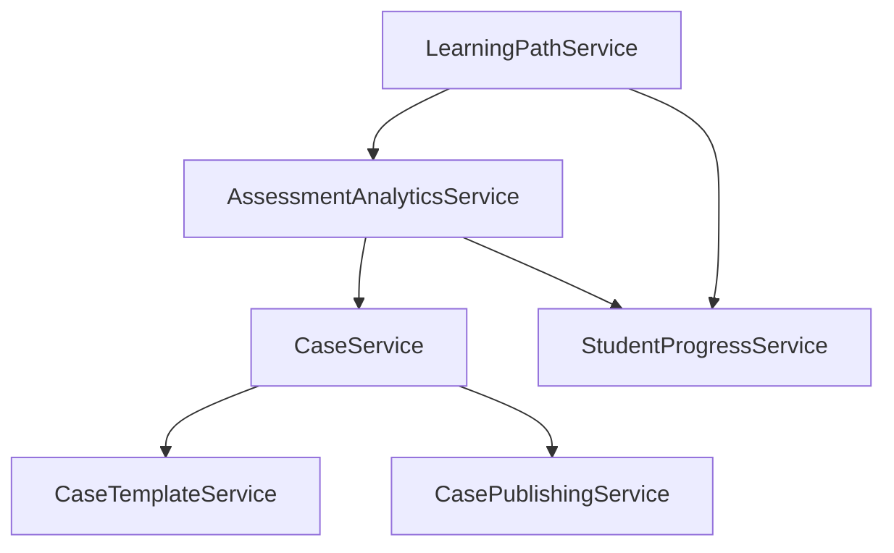

# Service Catalog

**Effective Date**: 2025-10-20
**Author**: Kilo Code System
**Review Cycle**: Monthly

## Overview

This catalog documents all major services in the Kilo Code system, providing a comprehensive reference for developers and architects.

## Backend Services

### Core Services

#### CaseService
- **Location**: [`CaseService.js`](../../../SimulatorBackend/src/services/CaseService.js)
- **Purpose**: Core case management operations
- **Key Methods**:
  - `getCases(queryParams)` - Retrieve cases with filtering and pagination
  - `formatCase(caseData)` - Standardize case data format
  - `buildQuery(filters)` - Construct database queries
- **Related**: CaseTemplateService, CasePublishingService

#### CaseTemplateService
- **Location**: [`CaseTemplateService.js`](../../../SimulatorBackend/src/services/CaseTemplateService.js)
- **Purpose**: Template management for case creation
- **Key Methods**:
  - Template validation and processing
  - Template library management
  - Template inheritance handling

#### CasePublishingService
- **Location**: [`CasePublishingService.js`](../../../SimulatorBackend/src/services/CasePublishingService.js)
- **Purpose**: Case publication workflow management
- **Key Methods**:
  - Publication approval workflows
  - Case visibility management
  - Version control for cases

### Authentication & Authorization Services

#### authService
- **Location**: [`authService.js`](../../../SimulatorBackend/src/services/authService.js)
- **Purpose**: JWT token management and authentication
- **Key Methods**:
  - Token generation and validation
  - Password hashing and verification
  - Session management

#### RBACService
- **Location**: [`RBACService.js`](../../../SimulatorBackend/src/services/RBACService.js)
- **Purpose**: Role-based access control implementation
- **Key Methods**:
  - Permission checking
  - Role assignment and management
  - Access control enforcement

#### UserRegistrationService
- **Location**: [`UserRegistrationService.js`](../../../SimulatorBackend/src/services/UserRegistrationService.js)
- **Purpose**: User onboarding and registration workflows
- **Key Methods**:
  - User account creation
  - Email verification
  - Profile initialization

### Analytics & Assessment Services

#### AssessmentAnalyticsService
- **Location**: [`AssessmentAnalyticsService.js`](../../../SimulatorBackend/src/services/AssessmentAnalyticsService.js)
- **Purpose**: Performance evaluation and analytics
- **Key Methods**:
  - Real-time performance tracking
  - Competency assessment
  - Learning analytics generation

#### ProgressAnalyticsService
- **Location**: [`ProgressAnalyticsService.js`](../../../SimulatorBackend/src/services/ProgressAnalyticsService.js)
- **Purpose**: Student progress tracking and analysis
- **Key Methods**:
  - Progress data aggregation
  - Trend analysis
  - Performance reporting

#### StudentProgressService
- **Location**: [`StudentProgressService.js`](../../../SimulatorBackend/src/services/StudentProgressService.js)
- **Purpose**: Individual student progress management
- **Key Methods**:
  - Progress record maintenance
  - Achievement tracking
  - Learning path updates

### Educational Services

#### simulationService
- **Location**: [`simulationService.js`](../../../SimulatorBackend/src/services/simulationService.js)
- **Purpose**: Interactive simulation management
- **Key Methods**:
  - Simulation state management
  - Scenario progression
  - Real-time interaction handling

#### LearningPathService
- **Location**: [`LearningPathService.js`](../../../SimulatorBackend/src/services/LearningPathService.js)
- **Purpose**: Personalized learning recommendations
- **Key Methods**:
  - Adaptive learning path generation
  - Performance-based recommendations
  - Learning objective mapping

#### FeedbackService
- **Location**: [`FeedbackService.js`](../../../SimulatorBackend/src/services/FeedbackService.js)
- **Purpose**: Student feedback collection and delivery
- **Key Methods**:
  - Immediate feedback generation
  - Performance explanation
  - Improvement suggestions

#### CompetencyAssessmentService
- **Location**: [`CompetencyAssessmentService.js`](../../../SimulatorBackend/src/services/CompetencyAssessmentService.js)
- **Purpose**: Clinical competency evaluation
- **Key Methods**:
  - Competency framework application
  - Skills assessment
  - Proficiency level determination

### Medical Specialty Services

#### RadiologySimulationService
- **Location**: [`RadiologySimulationService.js`](../../../SimulatorBackend/src/services/RadiologySimulationService.js)
- **Purpose**: Radiology-specific simulation scenarios
- **Key Methods**:
  - Radiology case management
  - Imaging interpretation simulation
  - Radiology workflow handling

#### LaboratorySimulationService
- **Location**: [`LaboratorySimulationService.js`](../../../SimulatorBackend/src/services/LaboratorySimulationService.js)
- **Purpose**: Laboratory testing simulation
- **Key Methods**:
  - Lab test ordering simulation
  - Result interpretation
  - Quality control procedures

#### PharmacySimulationService
- **Location**: [`PharmacySimulationService.js`](../../../SimulatorBackend/src/services/PharmacySimulationService.js)
- **Purpose**: Pharmacy practice simulation
- **Key Methods**:
  - Medication management
  - Drug interaction checking
  - Pharmacy workflow simulation

#### nursingEvaluationService
- **Location**: [`nursingEvaluationService.js`](../../../SimulatorBackend/src/services/nursingEvaluationService.js)
- **Purpose**: Nursing assessment and evaluation
- **Key Methods**:
  - Nursing process simulation
  - Patient assessment tools
  - Care planning exercises

### Administrative Services

#### AdminUserManagementService
- **Location**: [`AdminUserManagementService.js`](../../../SimulatorBackend/src/services/AdminUserManagementService.js)
- **Purpose**: Administrative user management
- **Key Methods**:
  - User administration
  - Role management
  - System configuration

#### AdminStatsService
- **Location**: [`AdminStatsService.js`](../../../SimulatorBackend/src/services/AdminStatsService.js)
- **Purpose**: Administrative reporting and statistics
- **Key Methods**:
  - System usage analytics
  - Performance metrics
  - Administrative reporting

#### QualityCheckService
- **Location**: [`QualityCheckService.js`](../../../SimulatorBackend/src/services/QualityCheckService.js)
- **Purpose**: Content quality validation
- **Key Methods**:
  - Content review automation
  - Quality metrics calculation
  - Validation rule enforcement

### Infrastructure Services

#### emailService
- **Location**: [`emailService.js`](../../../SimulatorBackend/src/services/emailService.js)
- **Purpose**: Email communications and notifications
- **Key Methods**:
  - Email template management
  - Notification delivery
  - Email queue processing

#### queueService
- **Location**: [`queueService.js`](../../../SimulatorBackend/src/services/queueService.js)
- **Purpose**: Background job processing
- **Key Methods**:
  - Job queue management
  - Background task processing
  - Queue monitoring

#### AuditLoggerService
- **Location**: [`AuditLoggerService.js`](../../../SimulatorBackend/src/services/AuditLoggerService.js)
- **Purpose**: System audit trail management
- **Key Methods**:
  - Audit event logging
  - Security event tracking
  - Compliance reporting

## Frontend Services

### API Integration Services

#### apiService
- **Location**: [`apiService.ts`](../../../simulatorfrontend/src/services/apiService.ts)
- **Purpose**: Frontend API communication layer
- **Key Methods**:
  - HTTP request handling
  - Authentication token management
  - Error handling and retries

## Service Interaction Patterns

### Dependency Management

### Data Flow Architecture
- **Case Creation**: CaseService → CaseTemplateService → CasePublishingService
- **Assessment**: simulationService → AssessmentAnalyticsService → FeedbackService
- **Progress**: StudentProgressService → ProgressAnalyticsService → LearningPathService
- **Administration**: AdminUserManagementService → AdminStatsService → QualityCheckService

## Service Health Monitoring

### Key Metrics
- **Response Time**: Average service method execution time
- **Error Rate**: Percentage of failed service calls
- **Throughput**: Number of requests processed per minute
- **Resource Usage**: Memory and CPU consumption

### Monitoring Integration
- **Logging**: Structured logging for all service operations
- **Metrics**: Performance metrics collection and reporting
- **Alerts**: Automated alerting for service issues
- **Dashboards**: Real-time service health visualization

## Related Documentation
- [System Architecture Overview](../architecture/system-overview.md)
- [API Service Pattern](../patterns/api-service-pattern.md)
- [Service Layer Pattern](../patterns/service-layer-pattern.md)
- [Case Creation Workflow](../workflows/case-creation-workflow.md)
- [Student Simulation Workflow](../workflows/student-simulation-workflow.md)
- [Assessment and Feedback Workflow](../workflows/assessment-feedback-workflow.md)

## Service Evolution Guidelines

### Adding New Services
1. **Identify Responsibility**: Define clear service boundaries
2. **Design Interface**: Create consistent API patterns
3. **Implement Tests**: Comprehensive test coverage
4. **Document Usage**: Update service catalog
5. **Integration Testing**: Verify service interactions

### Service Modification
1. **Backward Compatibility**: Maintain existing interfaces
2. **Version Management**: Use semantic versioning
3. **Deprecation Strategy**: Plan for breaking changes
4. **Migration Path**: Provide upgrade guidance

## Success Metrics
- Service availability > 99.5%
- Average response time < 100ms
- Error rate < 0.1%
- Test coverage > 90%
- Documentation coverage 100%