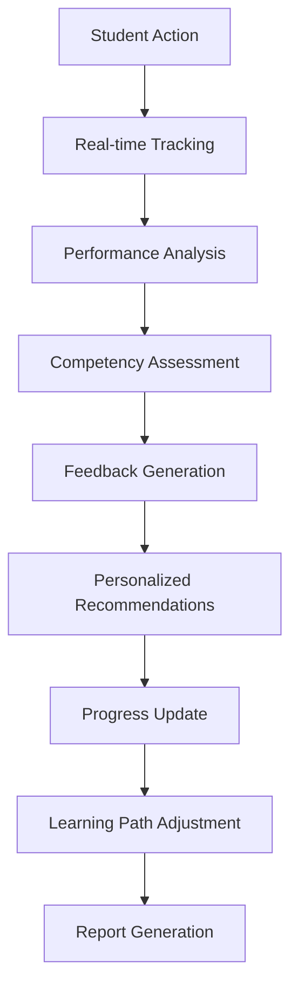
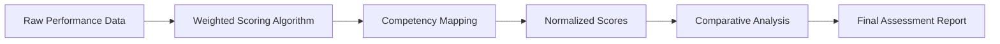

# Assessment and Feedback Workflow

**Effective Date**: 2025-10-20
**Author**: Kilo Code System
**Review Cycle**: Monthly

## Workflow Overview

## Key Stages

### 1. Real-time Action Tracking
- Capture all student interactions during simulation
- Record timing, sequence, and context of decisions
- Monitor engagement and attention patterns
- **Service**: [`InteractionTrackingService.js`](../../../SimulatorBackend/src/services/InteractionTrackingService.js)

### 2. Performance Data Analysis
- Aggregate interaction data into performance metrics
- Calculate scores against predefined criteria
- Identify patterns and trends in decision-making
- **Service**: [`AssessmentAnalyticsService.js`](../../../SimulatorBackend/src/services/AssessmentAnalyticsService.js)

### 3. Competency Evaluation
- Map performance data to learning objectives
- Assess clinical reasoning and critical thinking
- Evaluate technical skills and knowledge application
- **Service**: [`CompetencyAssessmentService.js`](../../../SimulatorBackend/src/services/CompetencyAssessmentService.js)

### 4. Intelligent Feedback Generation
- Create contextual, personalized feedback messages
- Provide evidence-based rationale for decisions
- Highlight learning opportunities and gaps
- **Services**:
  - [`FeedbackService.js`](../../../SimulatorBackend/src/services/FeedbackService.js)
  - [`AdvancedFeedbackService.js`](../../../SimulatorBackend/src/services/AdvancedFeedbackService.js)

### 5. Recommendation Engine
- Generate personalized learning recommendations
- Suggest remedial actions and practice opportunities
- Recommend next cases based on performance
- **Services**:
  - [`IntelligentRecommendationService.js`](../../../SimulatorBackend/src/services/IntelligentRecommendationService.js)
  - [`LearningPathService.js`](../../../SimulatorBackend/src/services/LearningPathService.js)

## Assessment Framework

### Multi-dimensional Evaluation

#### Clinical Reasoning Assessment
- **Diagnostic Accuracy**: Correctness of diagnosis and differential diagnosis
- **Treatment Appropriateness**: Evidence-based treatment selection
- **Risk Assessment**: Patient safety and complication awareness
- **Resource Utilization**: Efficient use of diagnostic tools and treatments

#### Technical Skills Assessment
- **Procedural Accuracy**: Correct execution of clinical procedures
- **Communication Skills**: Patient interaction and handoff quality
- **Documentation Quality**: Medical record keeping standards
- **Safety Protocols**: Infection control and patient safety adherence

#### Professionalism Assessment
- **Ethical Decision Making**: Patient autonomy and confidentiality
- **Cultural Competence**: Diversity and inclusion awareness
- **Interprofessional Collaboration**: Team communication effectiveness
- **Self-reflection**: Recognition of limitations and learning needs

### Scoring Methodology

## Feedback Delivery System

### Immediate Feedback Loop
- **Real-time Guidance**: Instant feedback during simulation
- **Contextual Hints**: Situation-appropriate suggestions
- **Error Correction**: Immediate identification of mistakes
- **Success Reinforcement**: Positive feedback for correct actions

### Comprehensive After-Action Review
- **Performance Summary**: Overall score and competency breakdown
- **Detailed Explanations**: Rationale for correct/incorrect decisions
- **Learning Objectives Review**: Connection to educational goals
- **Improvement Suggestions**: Specific areas for development

### Personalized Learning Path
- **Adaptive Recommendations**: Next steps based on performance
- **Remediation Plans**: Targeted learning for weak areas
- **Enrichment Opportunities**: Advanced challenges for strong performers
- **Progress Milestones**: Clear goals and achievement markers

## Data Integration Points

### Analytics Integration
- **ProgressAnalyticsService**: Long-term performance tracking
- **CaseContentAnalyticsService**: Content effectiveness measurement
- **StudentProgressService**: Individual learning journey
- **EducatorDashboardService**: Instructor insights and reporting

### Reporting System
- **ProgressPDFService**: Detailed performance reports
- **AdminStatsService**: Administrative analytics
- **QualityCheckService**: Assessment quality validation
- **AuditLoggerService**: Assessment event logging

## Quality Assurance

### Assessment Validation
- **Reliability Testing**: Consistency of scoring algorithms
- **Validity Studies**: Alignment with educational objectives
- **Bias Detection**: Fairness across different student groups
- **Calibration**: Regular updates to assessment criteria

### Feedback Quality Control
- **Content Review**: Accuracy and appropriateness of feedback
- **Tone Assessment**: Constructive and encouraging language
- **Cultural Sensitivity**: Inclusive and respectful communication
- **Educational Value**: Learning enhancement verification

## Performance Optimization

### Caching Strategy
- **Assessment Templates**: Pre-computed scoring frameworks
- **Feedback Library**: Reusable feedback components
- **Recommendation Engine**: Cached learning path algorithms
- **Historical Data**: Optimized access to past performance

### Scalability Considerations
- **Asynchronous Processing**: Background assessment calculation
- **Batch Operations**: Bulk feedback generation
- **Load Distribution**: Assessment workload balancing
- **Database Optimization**: Efficient progress data storage

## Integration APIs

### External Assessment Tools
- **Standardized Testing**: Integration with external assessment platforms
- **Certification Tracking**: Professional certification management
- **Benchmarking**: Comparison with peer performance
- **Accreditation Reporting**: Compliance and standards reporting

### Learning Management Systems
- **Gradebook Integration**: LMS grade synchronization
- **Assignment Mapping**: Case alignment with curriculum
- **Progress Sharing**: Cross-platform progress tracking
- **Analytics Export**: Data sharing with institutional systems

## Related Documentation
- [Assessment Analytics Service](../../../SimulatorBackend/src/services/AssessmentAnalyticsService.js)
- [Feedback Service](../../../SimulatorBackend/src/services/FeedbackService.js)
- [Progress Tracking](../../../simulatorfrontend/src/components/SkillBreakdown.tsx)
- [Learning Path Service](../../../SimulatorBackend/src/services/LearningPathService.js)
- [Competency Assessment](../../../SimulatorBackend/src/services/CompetencyAssessmentService.js)
- [Student Progress](../../../SimulatorBackend/src/services/StudentProgressService.js)

## Success Metrics
- Assessment completion time < 5 seconds
- Feedback delivery time < 2 seconds
- Recommendation accuracy > 85%
- Student satisfaction with feedback > 90%
- Assessment reliability coefficient > 0.8
- Fairness index across demographics > 0.95