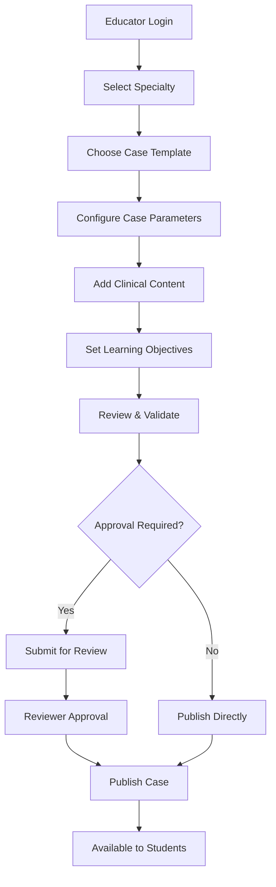

# Case Creation Workflow

**Effective Date**: 2025-10-17  
**Author**: Kilo Code System  
**Review Cycle**: Monthly

## Workflow Overview

## Key Stages

### 1. Authentication & Authorization
- Educator must be logged in with appropriate permissions
- Role-based access control validates specialty access
- **Implementation**: [`Authentication_System.md`](../../../SimulatorBackend/docs/Authentication_System.md)

### 2. Specialty Selection
- Educator selects from available specialties
- System validates educator's specialty permissions
- **Related**: [`RBAC_System.md`](../../../SimulatorBackend/docs/RBAC_System.md)

### 3. Template Configuration
- Choose from predefined case templates
- Templates provide structure for different case types
- **Documentation**: [`CASE_TEMPLATES.md`](../../../SimulatorBackend/docs/CASE_TEMPLATES.md)

### 4. Content Creation
- Add clinical scenarios, patient data, diagnostic information
- Configure learning objectives and assessment criteria
- Set difficulty levels and time constraints

### 5. Review Process
- Optional peer review for quality assurance
- Automated validation checks for completeness
- **API Reference**: [`CASE_PUBLISHING_API.md`](../../../SimulatorBackend/docs/CASE_PUBLISHING_API.md)

## Service Integration

### Backend Services
- **CaseService**: Core case management logic
- **CaseTemplateService**: Template handling and validation
- **RBACService**: Permission checking
- **CasePublishingService**: Publication workflow management

### Frontend Components
- Educator dashboard interface
- Case creation forms
- Review and preview functionality

## Data Flow

### Input Validation
- Required field validation
- Clinical data format checking
- Learning objective completeness

### Storage
- Cases stored in MongoDB with versioning
- Template associations maintained
- Audit trail for all changes

### Publication
- Cases marked as active/published
- Visibility controlled by specialty permissions
- Student access granted through role-based system

## Quality Assurance

### Automated Checks
- Data completeness validation
- Format compliance
- Link integrity verification

### Manual Review
- Clinical accuracy verification
- Educational value assessment
- Technical functionality testing

## Related Documentation
- [Case Publishing API](../../../SimulatorBackend/docs/CASE_PUBLISHING_API.md)
- [Case Templates](../../../SimulatorBackend/docs/CASE_TEMPLATES.md)
- [Educator Dashboard](../../../SimulatorBackend/docs/EDUCATOR_DASHBOARD.md)
- [RBAC System](../../../SimulatorBackend/docs/RBAC_System.md)
- [Student Simulation Workflow](../workflows/student-simulation-workflow.md)
- [Assessment and Feedback Workflow](../workflows/assessment-feedback-workflow.md)
- [System Architecture Overview](../architecture/system-overview.md)