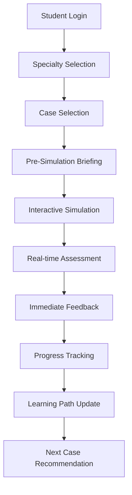
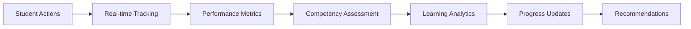

# Student Simulation Workflow

**Effective Date**: 2025-10-20
**Author**: Kilo Code System
**Review Cycle**: Monthly

## Workflow Overview

## Key Stages

### 1. Authentication & Access
- Student authentication via JWT tokens
- Role verification and specialty access validation
- Session establishment and user context loading
- **Implementation**: [`authService.js`](../../../SimulatorBackend/src/services/authService.js)

### 2. Specialty Navigation
- Display available medical specialties
- Filter cases by specialty and difficulty level
- Show case completion statistics and progress
- **Components**: [`SpecialtyNavigation.tsx`](../../../simulatorfrontend/src/components/SpecialtyNavigation.tsx)

### 3. Case Selection Process
- Browse available cases within selected specialty
- View case metadata (difficulty, duration, learning objectives)
- Check prerequisites and completion requirements
- **Service**: [`CaseSearchService.js`](../../../SimulatorBackend/src/services/CaseSearchService.js)

### 4. Pre-Simulation Preparation
- Display case briefing and patient information
- Present learning objectives and success criteria
- Load any prerequisite knowledge or resources
- **Components**: [`CaseCard.tsx`](../../../simulatorfrontend/src/components/CaseCard.tsx)

### 5. Interactive Simulation
- Real-time case interaction and decision making
- Dynamic scenario evolution based on student choices
- Multimedia content integration (images, videos, audio)
- **Services**:
  - [`simulationService.js`](../../../SimulatorBackend/src/services/simulationService.js)
  - [`RadiologySimulationService.js`](../../../SimulatorBackend/src/services/RadiologySimulationService.js)
  - [`LaboratorySimulationService.js`](../../../SimulatorBackend/src/services/LaboratorySimulationService.js)

### 6. Assessment & Evaluation
- Real-time performance tracking and scoring
- Competency assessment against learning objectives
- Critical action identification and analysis
- **Services**:
  - [`AssessmentAnalyticsService.js`](../../../SimulatorBackend/src/services/AssessmentAnalyticsService.js)
  - [`CompetencyAssessmentService.js`](../../../SimulatorBackend/src/services/CompetencyAssessmentService.js)

### 7. Feedback Delivery
- Immediate performance feedback and explanations
- Detailed rationale for correct/incorrect decisions
- Personalized learning recommendations
- **Services**:
  - [`FeedbackService.js`](../../../SimulatorBackend/src/services/FeedbackService.js)
  - [`AdvancedFeedbackService.js`](../../../SimulatorBackend/src/services/AdvancedFeedbackService.js)

### 8. Progress Integration
- Update student progress and completion records
- Calculate performance metrics and trends
- Unlock new cases and learning paths
- **Services**:
  - [`StudentProgressService.js`](../../../SimulatorBackend/src/services/StudentProgressService.js)
  - [`ProgressAnalyticsService.js`](../../../SimulatorBackend/src/services/ProgressAnalyticsService.js)

## Data Flow Architecture

### State Management
- **Frontend State**: React Context API for simulation state
- **Backend State**: MongoDB for persistent progress tracking
- **Real-time Updates**: WebSocket or Server-Sent Events for live feedback
- **Caching Strategy**: Redis for frequently accessed case data

### Assessment Data Pipeline

## Integration Points

### Service Interactions
- **CaseService**: Case data retrieval and updates
- **simulationStateService**: Simulation state management
- **InteractionTrackingService**: User interaction logging
- **LearningPathService**: Personalized recommendations
- **ProgressPDFService**: Report generation

### Component Integration
- **SimulationInterface**: Main simulation container
- **ProgressCard**: Progress visualization
- **FeedbackModal**: Feedback display
- **SkillBreakdown**: Competency visualization
- **SessionManager**: Session state management

## Quality Assurance

### Validation Checks
- Case data integrity verification
- Learning objective alignment
- Assessment criteria validation
- Performance calculation accuracy

### Error Handling
- Network failure recovery
- State corruption detection
- Graceful degradation for missing resources
- Comprehensive error logging and reporting

## Performance Considerations

### Optimization Strategies
- **Lazy Loading**: Case content loaded on demand
- **Caching**: Frequently accessed case metadata
- **Compression**: Large multimedia content optimization
- **Background Processing**: Non-blocking progress updates

### Scalability Measures
- **Load Balancing**: Simulation traffic distribution
- **Database Indexing**: Efficient progress queries
- **Connection Pooling**: Database connection management
- **Horizontal Scaling**: Multi-instance deployment

## Related Documentation
- [Simulation Interface](../../../simulatorfrontend/src/pages/SimulationInterface.tsx)
- [Progress Tracking System](../../../simulatorfrontend/src/components/SkillBreakdown.tsx)
- [Assessment Analytics](../../../SimulatorBackend/src/services/AssessmentAnalyticsService.js)
- [Learning Path Service](../../../SimulatorBackend/src/services/LearningPathService.js)
- [Student Dashboard](../../../SimulatorBackend/src/services/StudentDashboardService.js)

## Success Metrics
- Average simulation completion time < 30 minutes
- Student progress update latency < 2 seconds
- Feedback delivery time < 1 second
- System availability > 99.5%
- User action tracking accuracy > 99%