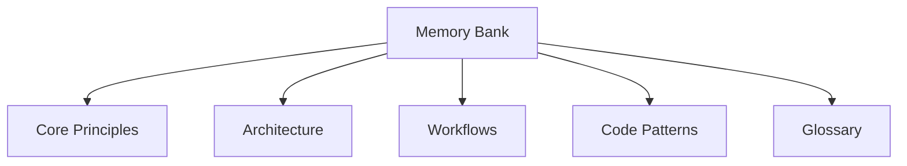

# Memory Bank Instructions

## Purpose
The Memory Bank serves as a centralized knowledge repository for storing:
- System operation rules
- Architectural decisions
- Critical implementation patterns
- Cross-team agreements
- Historical context for key decisions

## Structure

## Usage Guidelines
1. **Storage Format**: All entries must use Markdown with Mermaid diagrams for complex relationships
2. **Versioning**: Each entry requires:
   - Effective date
   - Author/team
   - Review cycle (e.g., "Review quarterly")
3. **Linking**: Cross-reference related entries using relative paths

## Maintenance Procedures
- Weekly validation checks against implementation
- Automated dead link detection
- Bi-monthly content reviews
- Version-controlled changes through PR process