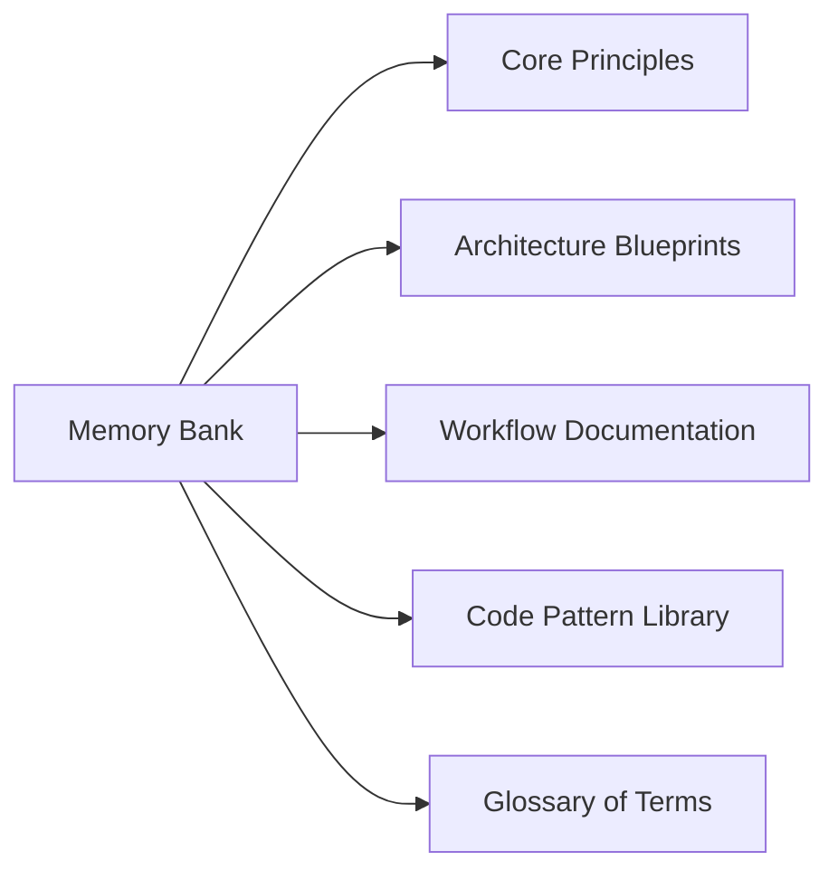

# Memory Bank System - Project Brief

## Overview
The Memory Bank serves as the authoritative knowledge repository for the Kilo Code system, capturing critical architectural decisions, implementation patterns, and operational guidelines.

## Objectives
1. Establish single source of truth for system knowledge
2. Document cross-component relationships and dependencies
3. Preserve historical context for key technical decisions
4. Enable efficient onboarding of new contributors

## Scope

## Key Components
- **Decision Log**: Chronological record of architectural choices
- **Pattern Catalog**: Reusable implementation templates
- **Interface Contracts**: Service API specifications
- **Operational Playbooks**: System maintenance procedures

## Implementation Strategy
1. Phase 1: Foundation (Core structure + basic documentation)
2. Phase 2: Integration (Link with existing components)
3. Phase 3: Automation (CI/CD validation checks)
4. Phase 4: Governance (Review workflows + access controls)

## Success Metrics
- 100% coverage of critical system components
- 24-hour new contributor onboarding time
- Zero undocumented major architectural changes
- 95% link integrity maintained