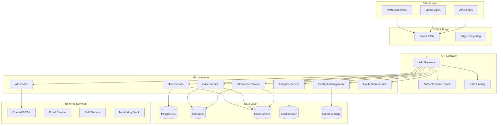
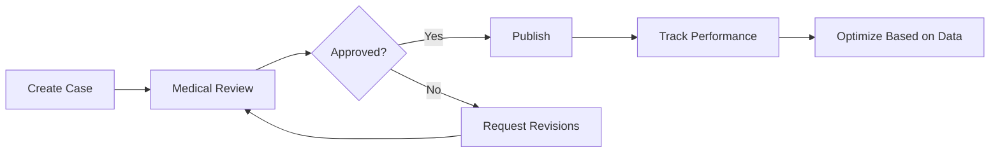

# Global Competitiveness Transformation - Design Document

## Overview

This design document outlines the comprehensive architecture and implementation strategy to transform Simuatech into a globally competitive medical education platform. The transformation will be executed in four phases over 18 months, with each phase building upon the previous one while maintaining backward compatibility and zero-downtime deployments.

## Architecture

### High-Level System Architecture



### Technology Stack Evolution

#### Phase 1: Foundation (Months 1-3)
- **Backend**: Node.js with TypeScript migration
- **Database**: PostgreSQL for relational data, MongoDB for document data
- **Caching**: Redis for session and application caching
- **Testing**: Jest, Supertest, Playwright for E2E
- **CI/CD**: GitHub Actions with automated testing
- **Monitoring**: Prometheus, Grafana, ELK Stack

#### Phase 2: Scalability (Months 4-6)
- **Containerization**: Docker with Kubernetes orchestration
- **Microservices**: Service mesh with Istio
- **Message Queue**: Apache Kafka for event streaming
- **Search**: Elasticsearch for content and analytics
- **CDN**: CloudFlare or AWS CloudFront
- **Load Balancing**: NGINX with auto-scaling

#### Phase 3: Advanced Features (Months 7-12)
- **AI/ML**: TensorFlow Serving for custom models
- **Real-time**: WebRTC for voice/video features
- **Mobile**: React Native with offline capabilities
- **Analytics**: Apache Spark for big data processing
- **Security**: Vault for secrets management
- **Compliance**: Automated compliance monitoring

#### Phase 4: Global Scale (Months 13-18)
- **Multi-region**: Global deployment with data residency
- **Edge Computing**: Cloudflare Workers for edge processing
- **Advanced AI**: Custom medical AI models
- **Research Platform**: Data lake with ML pipelines
- **Enterprise**: Advanced multi-tenancy and white-labeling

## Components and Interfaces

### 1. Testing Infrastructure

#### Backend Testing Strategy
```typescript
// Test Structure
src/
├── __tests__/
│   ├── unit/           # Unit tests for individual functions
│   ├── integration/    # API endpoint tests
│   ├── e2e/           # End-to-end user journey tests
│   └── performance/   # Load and performance tests
├── __mocks__/         # Mock implementations
└── test-utils/        # Testing utilities and helpers
```

#### Test Coverage Requirements
- **Unit Tests**: 80% minimum coverage
- **Integration Tests**: All API endpoints
- **E2E Tests**: Critical user journeys
- **Performance Tests**: Load testing for 10k concurrent users

#### Testing Tools Implementation
```javascript
// Jest Configuration
module.exports = {
  preset: 'ts-jest',
  testEnvironment: 'node',
  coverageThreshold: {
    global: {
      branches: 80,
      functions: 80,
      lines: 80,
      statements: 80
    }
  },
  setupFilesAfterEnv: ['<rootDir>/src/test-utils/setup.ts']
};
```

### 2. Infrastructure & DevOps

#### Kubernetes Deployment Architecture
```yaml
# Production Deployment Structure
apiVersion: apps/v1
kind: Deployment
metadata:
  name: simuatech-api
spec:
  replicas: 3
  selector:
    matchLabels:
      app: simuatech-api
  template:
    spec:
      containers:
      - name: api
        image: simuatech/api:latest
        resources:
          requests:
            memory: "256Mi"
            cpu: "250m"
          limits:
            memory: "512Mi"
            cpu: "500m"
```

#### Monitoring & Observability Stack
```yaml
# Prometheus Configuration
global:
  scrape_interval: 15s
  evaluation_interval: 15s

scrape_configs:
  - job_name: 'simuatech-api'
    static_configs:
      - targets: ['api:3000']
    metrics_path: /metrics
    scrape_interval: 5s
```

### 3. Content Management System

#### Case Management Workflow


#### Content Schema Design
```typescript
interface MedicalCase {
  id: string;
  version: number;
  metadata: {
    title: string;
    specialty: string;
    difficulty: 'beginner' | 'intermediate' | 'advanced';
    learningObjectives: string[];
    estimatedDuration: number;
    medicalAccuracy: {
      reviewedBy: string;
      reviewDate: Date;
      approvalStatus: 'pending' | 'approved' | 'rejected';
    };
  };
  content: {
    patientPersona: PatientPersona;
    clinicalDossier: ClinicalDossier;
    simulationFlow: SimulationStep[];
    evaluationCriteria: EvaluationCriteria;
  };
  analytics: {
    completionRate: number;
    averageScore: number;
    timeToComplete: number;
    studentFeedback: number;
  };
}
```

### 4. Advanced AI Features

#### AI Service Architecture
```typescript
class AdvancedAIService {
  private openaiClient: OpenAI;
  private customModels: Map<string, MLModel>;
  
  async generatePatientResponse(
    context: ConversationContext,
    medicalHistory: MedicalHistory,
    personalityProfile: PersonalityProfile
  ): Promise<PatientResponse> {
    // Multi-model approach for more realistic responses
    const medicalAccuracy = await this.validateMedicalAccuracy(context);
    const personalityResponse = await this.generatePersonalityResponse(context, personalityProfile);
    const clinicalRealism = await this.ensureClinicalRealism(context, medicalHistory);
    
    return this.synthesizeResponse(medicalAccuracy, personalityResponse, clinicalRealism);
  }
  
  async provideClinicalFeedback(
    studentActions: StudentAction[],
    caseObjectives: LearningObjective[]
  ): Promise<ClinicalFeedback> {
    // AI-powered feedback based on clinical reasoning patterns
    return await this.customModels.get('clinical-reasoning').predict({
      actions: studentActions,
      objectives: caseObjectives,
      expertPatterns: await this.getExpertPatterns()
    });
  }
}
```

#### Voice Integration
```typescript
interface VoiceSimulationService {
  startVoiceSession(sessionId: string): Promise<VoiceSession>;
  processVoiceInput(audio: AudioBuffer): Promise<TranscriptionResult>;
  generateVoiceResponse(text: string, voiceProfile: VoiceProfile): Promise<AudioBuffer>;
  analyzeVoiceTone(audio: AudioBuffer): Promise<EmotionalAnalysis>;
}
```

### 5. Multi-tenancy & Enterprise Features

#### Tenant Isolation Architecture
```typescript
interface TenantContext {
  tenantId: string;
  subdomain: string;
  customization: {
    branding: BrandingConfig;
    features: FeatureFlags;
    integrations: IntegrationConfig[];
  };
  limits: {
    maxUsers: number;
    maxCases: number;
    apiRateLimit: number;
  };
}

class TenantService {
  async createTenant(config: TenantConfig): Promise<Tenant> {
    // Create isolated database schemas
    await this.createTenantSchema(config.tenantId);
    
    // Set up tenant-specific resources
    await this.provisionTenantResources(config);
    
    // Configure custom domain and SSL
    await this.setupCustomDomain(config.domain);
    
    return this.saveTenant(config);
  }
}
```

#### Role-Based Access Control
```typescript
interface RBACSystem {
  roles: {
    'super-admin': Permission[];
    'institution-admin': Permission[];
    'program-director': Permission[];
    'instructor': Permission[];
    'student': Permission[];
  };
  
  permissions: {
    'cases.create': boolean;
    'cases.edit': boolean;
    'cases.delete': boolean;
    'users.manage': boolean;
    'analytics.view': boolean;
    'settings.modify': boolean;
  };
}
```

## Data Models

### Enhanced Database Schema

#### PostgreSQL (Relational Data)
```sql
-- Users and Authentication
CREATE TABLE users (
    id UUID PRIMARY KEY DEFAULT gen_random_uuid(),
    tenant_id UUID NOT NULL,
    email VARCHAR(255) UNIQUE NOT NULL,
    username VARCHAR(100) UNIQUE NOT NULL,
    password_hash VARCHAR(255) NOT NULL,
    role user_role NOT NULL DEFAULT 'student',
    profile JSONB,
    preferences JSONB,
    created_at TIMESTAMP DEFAULT NOW(),
    updated_at TIMESTAMP DEFAULT NOW(),
    last_login TIMESTAMP,
    is_active BOOLEAN DEFAULT true
);

-- Institutions and Tenants
CREATE TABLE tenants (
    id UUID PRIMARY KEY DEFAULT gen_random_uuid(),
    name VARCHAR(255) NOT NULL,
    subdomain VARCHAR(100) UNIQUE NOT NULL,
    custom_domain VARCHAR(255),
    settings JSONB,
    subscription_tier VARCHAR(50),
    created_at TIMESTAMP DEFAULT NOW(),
    updated_at TIMESTAMP DEFAULT NOW()
);

-- Performance Analytics
CREATE TABLE user_performance (
    id UUID PRIMARY KEY DEFAULT gen_random_uuid(),
    user_id UUID REFERENCES users(id),
    case_id UUID NOT NULL,
    session_id UUID NOT NULL,
    score INTEGER,
    completion_time INTERVAL,
    metrics JSONB,
    feedback JSONB,
    created_at TIMESTAMP DEFAULT NOW()
);
```

#### MongoDB (Document Data)
```javascript
// Medical Cases Collection
{
  _id: ObjectId,
  tenantId: ObjectId,
  caseId: "VP-CARD-001",
  version: "2.1.0",
  metadata: {
    title: "Acute Myocardial Infarction",
    specialty: "Cardiology",
    difficulty: "intermediate",
    tags: ["emergency", "chest-pain", "ECG"],
    learningObjectives: [
      "Recognize STEMI presentation",
      "Order appropriate diagnostics",
      "Initiate emergency treatment"
    ],
    medicalReview: {
      reviewerId: ObjectId,
      reviewDate: ISODate,
      status: "approved",
      comments: "Clinically accurate presentation"
    }
  },
  content: {
    patientPersona: { /* Enhanced patient data */ },
    clinicalDossier: { /* Comprehensive medical history */ },
    simulationFlow: [ /* Interactive case progression */ ],
    multimedia: {
      images: ["ecg-001.jpg", "chest-xray-001.jpg"],
      videos: ["physical-exam-demo.mp4"],
      audio: ["heart-sounds.mp3"]
    }
  },
  analytics: {
    totalAttempts: 1247,
    averageScore: 78.5,
    completionRate: 0.89,
    averageTime: "PT45M",
    difficultyRating: 3.2,
    studentFeedback: 4.1
  },
  createdAt: ISODate,
  updatedAt: ISODate
}
```

### Caching Strategy

#### Redis Cache Layers
```typescript
interface CacheStrategy {
  // Session Cache (TTL: 24 hours)
  userSessions: Map<string, UserSession>;
  
  // Application Cache (TTL: 1 hour)
  caseMetadata: Map<string, CaseMetadata>;
  userProfiles: Map<string, UserProfile>;
  
  // Content Cache (TTL: 6 hours)
  caseContent: Map<string, CaseContent>;
  mediaAssets: Map<string, MediaAsset>;
  
  // Analytics Cache (TTL: 15 minutes)
  performanceMetrics: Map<string, PerformanceData>;
  leaderboards: Map<string, LeaderboardData>;
}
```

## Error Handling

### Comprehensive Error Management
```typescript
class ErrorHandler {
  static handle(error: Error, context: RequestContext): ErrorResponse {
    // Log error with full context
    logger.error('Application error', {
      error: error.message,
      stack: error.stack,
      userId: context.userId,
      tenantId: context.tenantId,
      requestId: context.requestId,
      timestamp: new Date().toISOString()
    });
    
    // Determine error type and response
    if (error instanceof ValidationError) {
      return new ErrorResponse(400, 'VALIDATION_ERROR', error.details);
    } else if (error instanceof AuthenticationError) {
      return new ErrorResponse(401, 'AUTHENTICATION_FAILED', 'Invalid credentials');
    } else if (error instanceof AuthorizationError) {
      return new ErrorResponse(403, 'INSUFFICIENT_PERMISSIONS', 'Access denied');
    } else if (error instanceof NotFoundError) {
      return new ErrorResponse(404, 'RESOURCE_NOT_FOUND', 'Requested resource not found');
    } else {
      // Generic server error - don't expose internal details
      return new ErrorResponse(500, 'INTERNAL_SERVER_ERROR', 'An unexpected error occurred');
    }
  }
}
```

### Circuit Breaker Pattern
```typescript
class CircuitBreaker {
  private failureCount = 0;
  private lastFailureTime?: Date;
  private state: 'CLOSED' | 'OPEN' | 'HALF_OPEN' = 'CLOSED';
  
  async execute<T>(operation: () => Promise<T>): Promise<T> {
    if (this.state === 'OPEN') {
      if (this.shouldAttemptReset()) {
        this.state = 'HALF_OPEN';
      } else {
        throw new Error('Circuit breaker is OPEN');
      }
    }
    
    try {
      const result = await operation();
      this.onSuccess();
      return result;
    } catch (error) {
      this.onFailure();
      throw error;
    }
  }
}
```

## Testing Strategy

### Test Pyramid Implementation
```typescript
// Unit Tests (70% of tests)
describe('CaseService', () => {
  it('should validate case metadata correctly', () => {
    const caseService = new CaseService();
    const invalidCase = { /* invalid case data */ };
    
    expect(() => caseService.validateCase(invalidCase))
      .toThrow(ValidationError);
  });
});

// Integration Tests (20% of tests)
describe('Case API Integration', () => {
  it('should create case with valid data', async () => {
    const response = await request(app)
      .post('/api/cases')
      .send(validCaseData)
      .expect(201);
    
    expect(response.body.caseId).toBeDefined();
  });
});

// E2E Tests (10% of tests)
describe('Complete Simulation Flow', () => {
  it('should allow student to complete full case', async () => {
    await page.goto('/simulation/VP-CARD-001');
    await page.click('[data-testid="start-simulation"]');
    
    // Simulate complete user journey
    await page.fill('[data-testid="question-input"]', 'What brings you in today?');
    await page.click('[data-testid="send-message"]');
    
    await expect(page.locator('[data-testid="patient-response"]'))
      .toContainText('chest pain');
  });
});
```

### Performance Testing
```typescript
// Load Testing with Artillery
module.exports = {
  config: {
    target: 'https://api.simuatech.com',
    phases: [
      { duration: 60, arrivalRate: 10 },  // Warm up
      { duration: 300, arrivalRate: 50 }, // Sustained load
      { duration: 120, arrivalRate: 100 } // Peak load
    ]
  },
  scenarios: [
    {
      name: 'Simulation Flow',
      weight: 70,
      flow: [
        { post: { url: '/api/auth/login', json: { /* credentials */ } } },
        { post: { url: '/api/simulation/start', json: { caseId: 'VP-CARD-001' } } },
        { get: { url: '/api/simulation/{{ sessionId }}/ask?question=Hello' } }
      ]
    }
  ]
};
```

This design provides a comprehensive foundation for transforming Simuatech into a globally competitive platform. The architecture is designed to be scalable, maintainable, and capable of handling enterprise-level requirements while maintaining the innovative AI-powered simulation capabilities that make the platform unique.