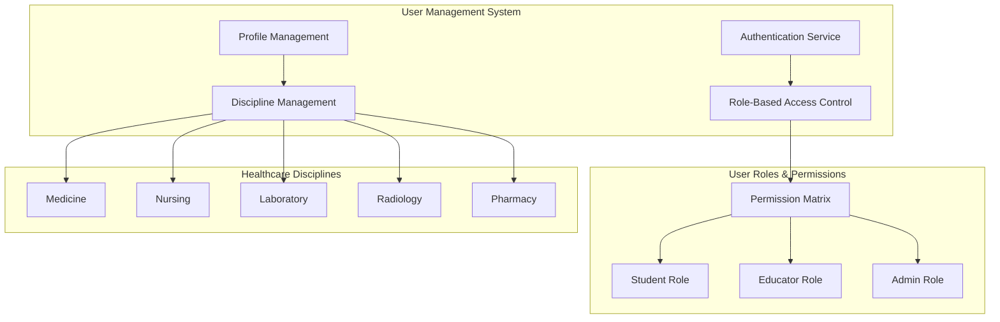
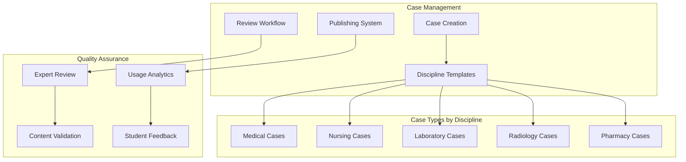

# Priority Features Implementation - Design Document

## Overview

This design document outlines the architecture and implementation strategy for the six priority functionalities that will transform Simuatech into a comprehensive healthcare education platform. The design focuses on scalability, maintainability, and user experience while supporting multiple healthcare disciplines.

## Architecture

### Enhanced User Management Architecture



### Case Management System Architecture



## Components and Interfaces

### 1. Enhanced User Management System

#### User Model Enhancement
```typescript
interface User {
  id: string;
  email: string;
  username: string;
  primaryRole: UserRole;
  secondaryRoles?: UserRole[];
  profile: UserProfile;
  discipline: HealthcareDiscipline;
  permissions: Permission[];
  createdAt: Date;
  updatedAt: Date;
  lastLogin: Date;
  isActive: boolean;
}

interface UserProfile {
  firstName: string;
  lastName: string;
  discipline: HealthcareDiscipline;
  specialization?: string;
  yearOfStudy?: number;
  institution: string;
  licenseNumber?: string;
  competencies: CompetencyProgress[];
  preferences: UserPreferences;
}

enum UserRole {
  STUDENT = 'student',
  EDUCATOR = 'educator',
  ADMIN = 'admin'
}

enum HealthcareDiscipline {
  MEDICINE = 'medicine',
  NURSING = 'nursing',
  LABORATORY = 'laboratory',
  RADIOLOGY = 'radiology',
  PHARMACY = 'pharmacy'
}

interface Permission {
  resource: string;
  action: string;
  conditions?: Record<string, any>;
}
```

#### Role-Based Access Control Implementation
```typescript
class RBACService {
  private permissions: Map<UserRole, Permission[]> = new Map([
    [UserRole.STUDENT, [
      { resource: 'cases', action: 'read' },
      { resource: 'simulations', action: 'create' },
      { resource: 'progress', action: 'read', conditions: { ownData: true } },
      { resource: 'feedback', action: 'read', conditions: { ownData: true } }
    ]],
    [UserRole.EDUCATOR, [
      { resource: 'cases', action: 'create' },
      { resource: 'cases', action: 'edit', conditions: { ownCases: true } },
      { resource: 'students', action: 'read', conditions: { ownStudents: true } },
      { resource: 'analytics', action: 'read', conditions: { ownClasses: true } }
    ]],
    [UserRole.ADMIN, [
      { resource: '*', action: '*' } // Full access
    ]]
  ]);

  async checkPermission(
    user: User, 
    resource: string, 
    action: string, 
    context?: any
  ): Promise<boolean> {
    const userPermissions = this.getUserPermissions(user);
    
    for (const permission of userPermissions) {
      if (this.matchesPermission(permission, resource, action)) {
        if (permission.conditions) {
          return this.evaluateConditions(permission.conditions, user, context);
        }
        return true;
      }
    }
    
    return false;
  }

  private getUserPermissions(user: User): Permission[] {
    const permissions: Permission[] = [];
    
    // Add primary role permissions
    permissions.push(...(this.permissions.get(user.primaryRole) || []));
    
    // Add secondary role permissions
    if (user.secondaryRoles) {
      for (const role of user.secondaryRoles) {
        permissions.push(...(this.permissions.get(role) || []));
      }
    }
    
    // Add user-specific permissions
    permissions.push(...user.permissions);
    
    return permissions;
  }
}
```

### 2. Multi-Disciplinary Case Management

#### Discipline-Specific Case Templates
```typescript
interface CaseTemplate {
  discipline: HealthcareDiscipline;
  type: string;
  structure: CaseStructure;
  assessmentCriteria: AssessmentCriteria[];
  learningObjectives: LearningObjective[];
}

interface MedicalCaseTemplate extends CaseTemplate {
  discipline: HealthcareDiscipline.MEDICINE;
  clinicalPresentation: ClinicalPresentation;
  diagnosticWorkup: DiagnosticStep[];
  treatmentOptions: TreatmentOption[];
  differentialDiagnosis: string[];
}

interface NursingCaseTemplate extends CaseTemplate {
  discipline: HealthcareDiscipline.NURSING;
  patientCareScenario: PatientCareScenario;
  nursingDiagnoses: NursingDiagnosis[];
  interventions: NursingIntervention[];
  outcomeEvaluation: OutcomeMetric[];
}

interface LaboratoryCaseTemplate extends CaseTemplate {
  discipline: HealthcareDiscipline.LABORATORY;
  specimenType: string;
  testRequests: LabTest[];
  qualityControlChecks: QCCheck[];
  resultInterpretation: InterpretationGuideline[];
}

interface RadiologyCaseTemplate extends CaseTemplate {
  discipline: HealthcareDiscipline.RADIOLOGY;
  imagingModality: string;
  clinicalIndication: string;
  imagingFindings: ImagingFinding[];
  reportingStructure: ReportSection[];
}

interface PharmacyCaseTemplate extends CaseTemplate {
  discipline: HealthcareDiscipline.PHARMACY;
  medicationTherapy: MedicationTherapy;
  drugInteractions: DrugInteraction[];
  patientCounseling: CounselingPoint[];
  monitoringParameters: MonitoringParameter[];
}
```

#### Case Creation Workflow
```typescript
class CaseManagementService {
  async createCase(
    template: CaseTemplate, 
    content: CaseContent, 
    creator: User
  ): Promise<Case> {
    // Validate user permissions
    await this.rbacService.checkPermission(creator, 'cases', 'create');
    
    // Validate case content against template
    const validationResult = await this.validateCaseContent(content, template);
    if (!validationResult.isValid) {
      throw new ValidationError(validationResult.errors);
    }
    
    // Create case with workflow status
    const caseData: Case = {
      id: generateId(),
      templateId: template.id,
      discipline: template.discipline,
      content: content,
      creator: creator.id,
      status: CaseStatus.DRAFT,
      workflow: {
        currentStep: WorkflowStep.CONTENT_REVIEW,
        assignedReviewer: await this.assignReviewer(template.discipline),
        history: [{
          step: WorkflowStep.CREATED,
          user: creator.id,
          timestamp: new Date(),
          notes: 'Case created'
        }]
      },
      createdAt: new Date(),
      updatedAt: new Date()
    };
    
    return await this.caseRepository.save(caseData);
  }

  async reviewCase(caseId: string, reviewer: User, decision: ReviewDecision): Promise<Case> {
    const case = await this.caseRepository.findById(caseId);
    
    // Validate reviewer permissions
    await this.rbacService.checkPermission(reviewer, 'cases', 'review');
    
    // Update workflow
    case.workflow.history.push({
      step: decision.approved ? WorkflowStep.APPROVED : WorkflowStep.REJECTED,
      user: reviewer.id,
      timestamp: new Date(),
      notes: decision.comments
    });
    
    if (decision.approved) {
      case.status = CaseStatus.PUBLISHED;
      case.publishedAt = new Date();
      
      // Index case for search
      await this.searchService.indexCase(case);
      
      // Notify relevant users
      await this.notificationService.notifyCasePublished(case);
    } else {
      case.status = CaseStatus.NEEDS_REVISION;
      case.workflow.currentStep = WorkflowStep.REVISION_REQUIRED;
      
      // Notify creator
      await this.notificationService.notifyRevisionRequired(case, decision.comments);
    }
    
    return await this.caseRepository.save(case);
  }
}
```

### 3. Comprehensive Progress Tracking

#### Progress Data Model
```typescript
interface StudentProgress {
  userId: string;
  discipline: HealthcareDiscipline;
  overallProgress: OverallProgress;
  competencyProgress: CompetencyProgress[];
  caseHistory: CaseAttempt[];
  learningPath: LearningPathProgress;
  achievements: Achievement[];
  createdAt: Date;
  updatedAt: Date;
}

interface CaseAttempt {
  id: string;
  caseId: string;
  sessionId: string;
  attemptNumber: number;
  startTime: Date;
  endTime?: Date;
  status: AttemptStatus;
  score: Score;
  detailedMetrics: DetailedMetrics;
  feedback: Feedback;
  timeSpent: number;
  interactions: Interaction[];
}

interface DetailedMetrics {
  clinicalReasoning: number;
  knowledgeApplication: number;
  communicationSkills: number;
  professionalBehavior: number;
  technicalSkills: number;
  criticalThinking: number;
  disciplineSpecific: Record<string, number>;
}

interface Interaction {
  timestamp: Date;
  type: InteractionType;
  content: string;
  context: Record<string, any>;
  aiResponse?: string;
  score?: number;
}

enum InteractionType {
  QUESTION_ASKED = 'question_asked',
  DIAGNOSIS_SUBMITTED = 'diagnosis_submitted',
  INTERVENTION_SELECTED = 'intervention_selected',
  RESOURCE_ACCESSED = 'resource_accessed',
  HINT_REQUESTED = 'hint_requested'
}
```

#### Progress Analytics Service
```typescript
class ProgressAnalyticsService {
  async getStudentDashboard(userId: string): Promise<StudentDashboard> {
    const progress = await this.progressRepository.findByUserId(userId);
    const recentAttempts = await this.getRecentAttempts(userId, 10);
    const competencyTrends = await this.calculateCompetencyTrends(userId);
    const recommendations = await this.generateRecommendations(userId);
    
    return {
      overallProgress: progress.overallProgress,
      recentPerformance: this.calculateRecentPerformance(recentAttempts),
      competencyRadar: this.buildCompetencyRadar(progress.competencyProgress),
      learningPath: progress.learningPath,
      achievements: progress.achievements,
      recommendations: recommendations,
      upcomingMilestones: await this.getUpcomingMilestones(userId),
      performanceTrends: competencyTrends
    };
  }

  async trackCaseCompletion(attempt: CaseAttempt): Promise<void> {
    // Update overall progress
    await this.updateOverallProgress(attempt.userId, attempt);
    
    // Update competency progress
    await this.updateCompetencyProgress(attempt.userId, attempt);
    
    // Update learning path
    await this.updateLearningPath(attempt.userId, attempt);
    
    // Check for achievements
    await this.checkAchievements(attempt.userId, attempt);
    
    // Generate personalized recommendations
    await this.updateRecommendations(attempt.userId);
  }

  async enableCaseRetake(userId: string, caseId: string): Promise<RetakeSession> {
    const previousAttempts = await this.getCaseAttempts(userId, caseId);
    const bestAttempt = this.findBestAttempt(previousAttempts);
    
    // Create retake session with context from previous attempts
    const retakeSession: RetakeSession = {
      id: generateId(),
      userId: userId,
      caseId: caseId,
      attemptNumber: previousAttempts.length + 1,
      previousBestScore: bestAttempt?.score,
      improvementAreas: this.identifyImprovementAreas(previousAttempts),
      adaptiveHints: await this.generateAdaptiveHints(userId, caseId, previousAttempts),
      createdAt: new Date()
    };
    
    return await this.retakeRepository.save(retakeSession);
  }
}
```

### 4. Advanced Scoring System

#### Scoring Framework
```typescript
interface ScoringFramework {
  discipline: HealthcareDiscipline;
  rubrics: ScoringRubric[];
  weights: ScoreWeights;
  normalization: NormalizationStrategy;
  reliability: ReliabilityMetrics;
}

interface ScoringRubric {
  criterion: string;
  levels: RubricLevel[];
  weight: number;
  description: string;
}

interface RubricLevel {
  level: number;
  label: string;
  description: string;
  indicators: string[];
  scoreRange: [number, number];
}

class AdvancedScoringService {
  private scoringFrameworks: Map<HealthcareDiscipline, ScoringFramework>;
  
  async calculateScore(attempt: CaseAttempt, case: Case): Promise<Score> {
    const framework = this.scoringFrameworks.get(case.discipline);
    if (!framework) {
      throw new Error(`No scoring framework found for discipline: ${case.discipline}`);
    }
    
    const rubricScores = await this.evaluateRubrics(attempt, case, framework.rubrics);
    const weightedScore = this.applyWeights(rubricScores, framework.weights);
    const normalizedScore = this.normalizeScore(weightedScore, framework.normalization);
    
    // Calculate reliability metrics
    const reliability = await this.calculateReliability(attempt, case);
    
    return {
      overall: normalizedScore,
      breakdown: rubricScores,
      reliability: reliability,
      percentile: await this.calculatePercentile(normalizedScore, case.id),
      feedback: await this.generateDetailedFeedback(rubricScores, case),
      improvementAreas: this.identifyImprovementAreas(rubricScores),
      calculatedAt: new Date()
    };
  }

  private async evaluateRubrics(
    attempt: CaseAttempt, 
    case: Case, 
    rubrics: ScoringRubric[]
  ): Promise<RubricScore[]> {
    const scores: RubricScore[] = [];
    
    for (const rubric of rubrics) {
      const score = await this.evaluateSingleRubric(attempt, case, rubric);
      scores.push(score);
    }
    
    return scores;
  }

  private async evaluateSingleRubric(
    attempt: CaseAttempt, 
    case: Case, 
    rubric: ScoringRubric
  ): Promise<RubricScore> {
    // Use AI-powered evaluation for consistency
    const aiEvaluation = await this.aiEvaluationService.evaluateRubric(
      attempt.interactions,
      case.evaluationCriteria,
      rubric
    );
    
    // Apply human expert validation for high-stakes assessments
    const expertValidation = await this.getExpertValidation(aiEvaluation, rubric);
    
    return {
      criterion: rubric.criterion,
      score: expertValidation?.score || aiEvaluation.score,
      level: this.determineLevelFromScore(aiEvaluation.score, rubric.levels),
      evidence: aiEvaluation.evidence,
      confidence: aiEvaluation.confidence,
      validated: !!expertValidation
    };
  }
}
```

### 5. Comprehensive Student Guidance System

#### Intelligent Tutoring System
```typescript
class IntelligentTutoringService {
  async provideContextualGuidance(
    userId: string, 
    currentContext: LearningContext
  ): Promise<GuidanceResponse> {
    const userProfile = await this.userService.getProfile(userId);
    const learningHistory = await this.progressService.getLearningHistory(userId);
    const currentCase = await this.caseService.getCase(currentContext.caseId);
    
    // Analyze current situation
    const analysis = await this.analyzeCurrentSituation(
      userProfile, 
      learningHistory, 
      currentCase, 
      currentContext
    );
    
    // Generate personalized guidance
    const guidance = await this.generateGuidance(analysis);
    
    return {
      type: guidance.type,
      content: guidance.content,
      resources: guidance.suggestedResources,
      nextSteps: guidance.recommendedActions,
      adaptiveHints: guidance.hints,
      confidence: guidance.confidence
    };
  }

  async createPersonalizedLearningPath(userId: string): Promise<LearningPath> {
    const userProfile = await this.userService.getProfile(userId);
    const competencyGaps = await this.assessmentService.identifyCompetencyGaps(userId);
    const availableCases = await this.caseService.getCasesByDiscipline(userProfile.discipline);
    
    // Use ML to optimize learning path
    const optimizedPath = await this.mlService.optimizeLearningPath({
      userProfile,
      competencyGaps,
      availableCases,
      learningPreferences: userProfile.preferences
    });
    
    return {
      userId: userId,
      milestones: optimizedPath.milestones,
      recommendedCases: optimizedPath.cases,
      estimatedDuration: optimizedPath.duration,
      adaptiveAdjustments: optimizedPath.adaptations,
      createdAt: new Date()
    };
  }
}
```

#### Help and Resource System
```typescript
interface HelpSystem {
  contextualHelp: ContextualHelp[];
  tutorials: Tutorial[];
  resources: LearningResource[];
  faq: FAQ[];
  supportChannels: SupportChannel[];
}

class HelpSystemService {
  async getContextualHelp(context: LearningContext): Promise<ContextualHelp[]> {
    const relevantHelp = await this.helpRepository.findByContext({
      discipline: context.discipline,
      caseType: context.caseType,
      currentStep: context.currentStep,
      userLevel: context.userLevel
    });
    
    // Personalize help based on user's learning history
    return this.personalizeHelp(relevantHelp, context.userId);
  }

  async searchResources(query: string, filters: ResourceFilters): Promise<LearningResource[]> {
    const searchResults = await this.searchService.search({
      query: query,
      filters: {
        discipline: filters.discipline,
        resourceType: filters.type,
        difficulty: filters.difficulty
      },
      boost: {
        relevance: 1.0,
        quality: 0.8,
        recency: 0.6
      }
    });
    
    return searchResults.map(result => ({
      ...result,
      personalizedRelevance: this.calculatePersonalizedRelevance(result, filters.userId)
    }));
  }
}
```

## Data Models

### Enhanced User Schema
```sql
-- Enhanced Users Table
CREATE TABLE users (
    id UUID PRIMARY KEY DEFAULT gen_random_uuid(),
    email VARCHAR(255) UNIQUE NOT NULL,
    username VARCHAR(100) UNIQUE NOT NULL,
    password_hash VARCHAR(255) NOT NULL,
    primary_role user_role NOT NULL,
    secondary_roles user_role[],
    discipline healthcare_discipline NOT NULL,
    profile JSONB NOT NULL,
    permissions JSONB DEFAULT '[]',
    created_at TIMESTAMP DEFAULT NOW(),
    updated_at TIMESTAMP DEFAULT NOW(),
    last_login TIMESTAMP,
    is_active BOOLEAN DEFAULT true,
    email_verified BOOLEAN DEFAULT false,
    two_factor_enabled BOOLEAN DEFAULT false
);

-- User Profiles Table
CREATE TABLE user_profiles (
    user_id UUID PRIMARY KEY REFERENCES users(id),
    first_name VARCHAR(100) NOT NULL,
    last_name VARCHAR(100) NOT NULL,
    specialization VARCHAR(100),
    year_of_study INTEGER,
    institution VARCHAR(255),
    license_number VARCHAR(100),
    competency_level VARCHAR(50),
    preferences JSONB DEFAULT '{}',
    created_at TIMESTAMP DEFAULT NOW(),
    updated_at TIMESTAMP DEFAULT NOW()
);

-- Progress Tracking Table
CREATE TABLE student_progress (
    id UUID PRIMARY KEY DEFAULT gen_random_uuid(),
    user_id UUID REFERENCES users(id),
    discipline healthcare_discipline NOT NULL,
    overall_progress JSONB NOT NULL,
    competency_progress JSONB NOT NULL,
    learning_path_progress JSONB NOT NULL,
    achievements JSONB DEFAULT '[]',
    created_at TIMESTAMP DEFAULT NOW(),
    updated_at TIMESTAMP DEFAULT NOW()
);
```

### Case Management Schema
```sql
-- Enhanced Cases Table
CREATE TABLE cases (
    id UUID PRIMARY KEY DEFAULT gen_random_uuid(),
    case_id VARCHAR(50) UNIQUE NOT NULL,
    discipline healthcare_discipline NOT NULL,
    template_id UUID,
    title VARCHAR(255) NOT NULL,
    description TEXT,
    difficulty difficulty_level NOT NULL,
    status case_status DEFAULT 'draft',
    creator_id UUID REFERENCES users(id),
    content JSONB NOT NULL,
    metadata JSONB NOT NULL,
    workflow JSONB NOT NULL,
    analytics JSONB DEFAULT '{}',
    published_at TIMESTAMP,
    created_at TIMESTAMP DEFAULT NOW(),
    updated_at TIMESTAMP DEFAULT NOW()
);

-- Case Attempts Table
CREATE TABLE case_attempts (
    id UUID PRIMARY KEY DEFAULT gen_random_uuid(),
    user_id UUID REFERENCES users(id),
    case_id UUID REFERENCES cases(id),
    session_id UUID NOT NULL,
    attempt_number INTEGER NOT NULL,
    start_time TIMESTAMP NOT NULL,
    end_time TIMESTAMP,
    status attempt_status DEFAULT 'in_progress',
    score JSONB,
    detailed_metrics JSONB,
    interactions JSONB DEFAULT '[]',
    feedback JSONB,
    time_spent INTEGER, -- in seconds
    created_at TIMESTAMP DEFAULT NOW(),
    UNIQUE(user_id, case_id, attempt_number)
);
```

This comprehensive design addresses all six priority areas with internationally acclaimed best practices, providing a robust foundation for a world-class healthcare education platform.