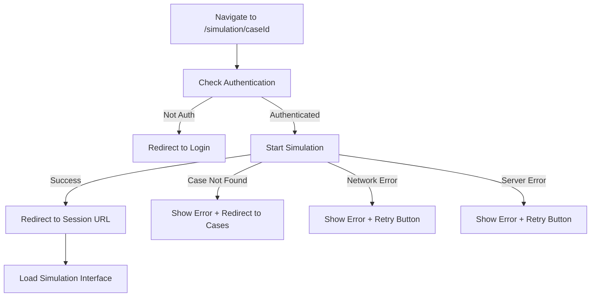

# Design Document

## Overview

This design addresses the simulation routing bug by implementing proper route handling for direct case access URLs. The solution involves updating the routing configuration, enhancing the SimulationChatPage component to handle case-only URLs, and improving error handling throughout the simulation startup process.

## Architecture

### Current State Analysis

The current routing system has these routes:
- `/simulation` - General simulation page
- `/simulation/:caseId/session/:sessionId?` - Specific simulation session

The issue is that when users navigate to `/simulation/VP-OPTH-001`, it doesn't match the expected route pattern and fails to start a simulation.

### Proposed Solution

1. **Enhanced Route Matching**: Update the routing to handle both `/simulation/:caseId` and `/simulation/:caseId/session/:sessionId` patterns
2. **Smart Component Logic**: Enhance SimulationChatPage to detect when only a caseId is provided and automatically start a new simulation
3. **Improved Error Handling**: Add comprehensive error handling for various failure scenarios
4. **URL Consistency**: Ensure proper URL updates and redirects maintain user experience

## Components and Interfaces

### 1. Route Configuration Updates

**File**: `simulatorfrontend/src/App.tsx`

Update the routing to include a dedicated route for case-only URLs:

```typescript
// Add new route for direct case access
<Route 
  path="/simulation/:caseId" 
  element={
    <ProtectedRoute>
      <SimulationChatPage />
    </ProtectedRoute>
  } 
/>
// Keep existing route for session access
<Route 
  path="/simulation/:caseId/session/:sessionId" 
  element={
    <ProtectedRoute>
      <SimulationChatPage />
    </ProtectedRoute>
  } 
/>
```

### 2. SimulationChatPage Enhancement

**File**: `simulatorfrontend/src/pages/SimulationChatPage.tsx`

Key changes needed:

1. **URL Parameter Detection**: Detect whether sessionId is present in URL
2. **Automatic Simulation Start**: When only caseId is present, automatically start new simulation
3. **Loading States**: Improve loading indicators during simulation startup
4. **Error Handling**: Add comprehensive error handling with user-friendly messages

### 3. Enhanced useEffect Logic

```typescript
useEffect(() => {
  if (caseId && !sessionId && !sessionData) {
    // Direct case access - start new simulation
    startNewSimulation();
  } else if (sessionId && !sessionData) {
    // Existing session access - load session data
    loadExistingSession();
  }
}, [caseId, sessionId]);
```

### 4. New Session Loading Function

Add a new function to handle existing session loading:

```typescript
const loadExistingSession = async () => {
  // Implementation to load existing session data
  // This will be useful for future session resumption features
};
```

## Data Models

### URL Parameter Interface

```typescript
interface SimulationParams {
  caseId: string;
  sessionId?: string;
}
```

### Enhanced Session State

```typescript
interface SessionState {
  sessionId?: string;
  patientName?: string;
  initialPrompt?: string;
  speaks_for?: string;
  isLoading: boolean;
  error?: string;
}
```

## Error Handling

### Error Types and Responses

1. **Invalid Case ID**
   - Display: "Case not found. Redirecting to case browser..."
   - Action: Redirect to `/browse-cases` or specialty context

2. **Network Errors**
   - Display: "Connection failed. Please check your internet and try again."
   - Action: Provide retry button

3. **Authentication Errors**
   - Display: "Session expired. Please log in again."
   - Action: Redirect to login

4. **Server Errors**
   - Display: "Server error. Please try again later."
   - Action: Provide retry button and log error details

### Error Handling Flow



## Testing Strategy

### Unit Tests

1. **Route Matching Tests**
   - Test `/simulation/VP-OPTH-001` matches correctly
   - Test `/simulation/VP-OPTH-001/session/123` matches correctly
   - Test invalid URLs are handled properly

2. **Component Logic Tests**
   - Test automatic simulation start with caseId only
   - Test session loading with both caseId and sessionId
   - Test error handling for various failure scenarios

3. **API Integration Tests**
   - Test startSimulation API call with valid case ID
   - Test startSimulation API call with invalid case ID
   - Test error responses are handled correctly

### Integration Tests

1. **End-to-End Navigation Tests**
   - Navigate directly to `/simulation/VP-OPTH-001`
   - Verify simulation starts automatically
   - Verify URL updates to include session ID
   - Verify chat interface becomes available

2. **Error Scenario Tests**
   - Test behavior with invalid case IDs
   - Test behavior with network failures
   - Test behavior with authentication failures

### Manual Testing Scenarios

1. **Direct Case Access**
   - Navigate to `/simulation/VP-OPTH-001`
   - Verify simulation starts and patient appears
   - Verify URL updates to include session ID

2. **Bookmark Testing**
   - Bookmark `/simulation/VP-OPTH-001`
   - Return to bookmark later
   - Verify new simulation starts correctly

3. **Error Recovery**
   - Test with invalid case ID
   - Test with network disconnected
   - Verify error messages and recovery options

## Implementation Notes

### Backward Compatibility

- Existing `/simulation/:caseId/session/:sessionId` URLs will continue to work
- No breaking changes to existing functionality
- Specialty context navigation will be preserved

### Performance Considerations

- Minimize API calls during route transitions
- Cache case metadata when possible
- Implement proper loading states to improve perceived performance

### Security Considerations

- Validate case IDs on both frontend and backend
- Ensure proper authentication checks before starting simulations
- Log security-relevant events for monitoring